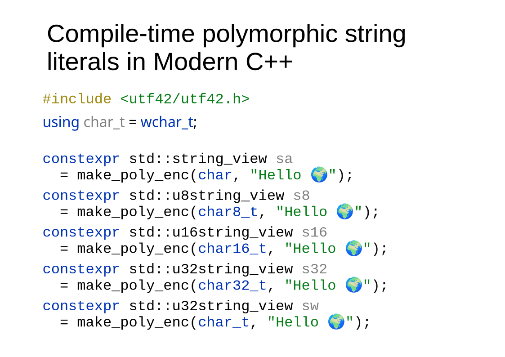

# 🌐 utf42

**Compile-time polymorphic string literals for modern C++**

`utf42` is a small, header-only C++ utility that allows you to define a string
**once** and obtain it as a `std::basic_string_view` of any character type
(`char`, `wchar_t`, `char8_t`, `char16_t`, `char32_t`) **entirely at compile time**.

It achieves this by leveraging the compiler’s built-in handling of Unicode
string literal prefixes (`""`, `L""`, `u8""`, `u""`, `U""`) and selecting the
appropriate encoding using `consteval` dispatch.

The result is **zero runtime overhead**, no heap allocation, and no runtime
Unicode transcoding.

---

## Index

## **📚 Index**

2. [✨ Features](#-features)
3. [❓ Motivation](#-motivation)
4. [📦 Requirements](#-requirements)
5. [🚀 Usage](#-usage)
7. [⚠️ Important Limitations](#-important-limitations)
8. [🧠 Design Philosophy](#-design-philosophy)
9. [🔗 Inclusion in Your Project](#-inclusion-in-your-project)
10. [📄 License](#-license)

---

## ✨ Features

- ✅ Single source of truth for string literals
- ✅ Zero runtime cost
- ✅ No heap allocation
- ✅ No UTF transcoding at runtime
- ✅ Full support for `\uXXXX` and `\UXXXXXXXX`
- ✅ Works with custom character typedefs
- ✅ Header-only
- ✅ C++20 compliant

---

## ❓ Motivation

C++ does not allow templating string literal prefixes:

```cpp
make_str<char16_t>("hello"); // ❌ impossible
```

This leads to duplicated literals like:
```cpp
"hello"
u"hello"
U"hello"
```

`utf42` solves this by:
1. Letting the compiler generate all encoded variants of a literal
2. Selecting the correct one at compile time based on the requested character type

---

## 📦 Requirements

- C++20 or later
    - char8_t
    - consteval
    - Concepts
- UTF-8 encoded source files
- A compiler with proper Unicode literal support (GCC, Clang, MSVC)

---

## 🚀 Usage

### **Basic example 1**

Approach: **one time use** string literal.

We use the macro `cons_poly_enc(CharacterType, lit)`
to process the string literal and reencode on
compile time to the desired character type.
This proves particularly usefull when the
character type is a template parameter.

```cpp
#include <utf42/utf42.h>

// Typedef of char32_t
using char42_t = char32_t;

// Different encoding views
constexpr std::basic_string_view<char>     strv_a  = make_poly_enc(char,     "Hello World \U0001F600!");
constexpr std::basic_string_view<char8_t>  strv_8  = make_poly_enc(char8_t,  "Hello World \U0001F600!");
constexpr std::basic_string_view<char16_t> strv_16 = make_poly_enc(char16_t, "Hello World \U0001F600!");
constexpr std::basic_string_view<char32_t> strv_32 = make_poly_enc(char32_t, "Hello World \U0001F600!");
constexpr std::basic_string_view<char42_t> strv_42 = make_poly_enc(char42_t, "Hello World \U0001F600!");
```

All variables above refer to the same logical string, encoded differently
by the compiler.

Converting back to UTF-8 (for display)

```cpp
std::string str_a  (strv_a);
std::string str_8  (char8_to_char(strv_8));
std::string str_16 (utf8::utf16to8(strv_16));
std::string str_32 (utf8::utf32to8(strv_32));
std::string str_42 (utf8::utf32to8(strv_42));
```

⚠️ Conversion helpers such as utf8::utf16to8 come from external libraries
(utf8cpp, `#include <utf8cpp/utf8.h>`) and are not part of utf42.

See [utfcpp documentation](https://github.com/nemtrif/utfcpp) for more information.

### **Basic example 2**

Approach: **multiple time use** string literal.

We use an instance of `utf42::poly_enc` to store all
variants and recover later the desired variant.
The macro `cons_poly_enc(lit)` constructs the object
from a single string literal.

```cpp
#include <utf42/utf42.h>

// Typedef of char32_t
using char42_t = char32_t;

// Create all different encoding string views
constexpr utf42::poly_enc oText = cons_poly_enc("Hello World \U0001F600!");
```

The variable above refer to the same logical string, encoded differently
by the compiler.

Converting back to UTF-8 (for display)

```cpp
// Re-encode everything to utf-8
std::string str_a(oText.TXT_CHAR);
std::string str_8(char8_to_char(oText.TXT_CHAR_8));
std::string str_16(utf8::utf16to8(oText.TXT_CHAR_16));
std::string str_32(utf8::utf32to8(oText.TXT_CHAR_32));
std::string str_42(utf8::utf32to8(oText.visit<char42_t>()));
```

It is possible to use the function template `template<CharType char_t>
constexpr std::basic_string_view<char_t>
utf42::poly_enc::visit() const noexcept`
to recover the data in template scenarios.

⚠️ Conversion helpers such as utf8::utf16to8 come from external libraries
(utf8cpp, `#include <utf8cpp/utf8.h>`) and are not part of utf42.

See [utfcpp documentation](https://github.com/nemtrif/utfcpp) for more information.

---

### **Output**

```cpp
std::cout << "Original: " << str_a  << '\n';
std::cout << "utf-8:    " << str_8  << '\n';
std::cout << "utf-16:   " << str_16 << '\n';
std::cout << "utf-32:   " << str_32 << '\n';
std::cout << "utf-42:   " << str_42 << '\n';
```

**Display on the terminal:**
```txt
Original: Hello World 😀!
utf-8:    Hello World 😀!
utf-16:   Hello World 😀!
utf-32:   Hello World 😀!
utf-42:   Hello World 😀!
```

**⚠️ Terminal encoding requirement**

Your terminal MUST be configured to use UTF-8 for this particular example to
print the output correctly. The user may re-encode the text appropriately
or change the setup of the terminal.

If the terminal encoding is not UTF-8:
- Unicode characters may appear as ?, □, or mojibake
- This is not a bug in utf42

Common setups:
- Linux / macOS: UTF-8 by default
- Windows:
    - Use Windows Terminal, or
    - Run: `chcp 65001`

---

## **⚠️ Important limitations**

The macro `make_poly_enc` must be used with string literals only.
Any other input will result in undefined behavior.
- No runtime strings
- No dynamic encoding conversion
- No grapheme-cluster or text-shaping logic
- This library operates strictly at the **code-unit level**.

Such as:
```
make_poly_enc(char16_t, "OK");     // ✅ valid
make_poly_enc(char16_t, someVar);  // ❌ undefined behavior
```

---

## **🧠 Design philosophy**

- Header only library
- Let the compiler handle Unicode parsing
- Prefer compile-time work over runtime work
- Avoid unnecessary abstraction or dependencies
- Keep the API minimal, explicit, and fast

Ideal use cases include:
- Logging systems
- Localization keys
- Cross-platform APIs
- Performance-critical code
- Compile-time configuration strings

---

## **🔗 Inclusion in your project**

This section explains how to include this library in your project.

### Copy-pase inclusion

Simply copy the header [utf42.h](./utf42.h) into your project.
No additional setup or configuration is required.

### Cmake inclusion

You need the `FetchContent` package:
```cmake
include(FetchContent)
```

For more details, see the [FetchContent documentation](https://cmake.org/cmake/help/latest/module/FetchContent.html).

Then, copy the following code into your CMake file to fetch the `utf42` library:
```cmake
# Fetch the utf42 library
FetchContent_Declare(
        utf42
        GIT_REPOSITORY https://github.com/dante19031999/utf42
        GIT_TAG master
)
FetchContent_MakeAvailable(utf42)
```

After fetching the library, link it with your target.
Use the following line in your CMake configuration:
```cmake
target_link_libraries(mylib VISIBILITY utf42::utf42)
```

For more details, see the [target_link_libraries documentation](https://cmake.org/cmake/help/latest/command/target_link_libraries.html).

---

## **📄 License**

MIT License

Copyright (c) 2025
Dante Doménech Martínez


